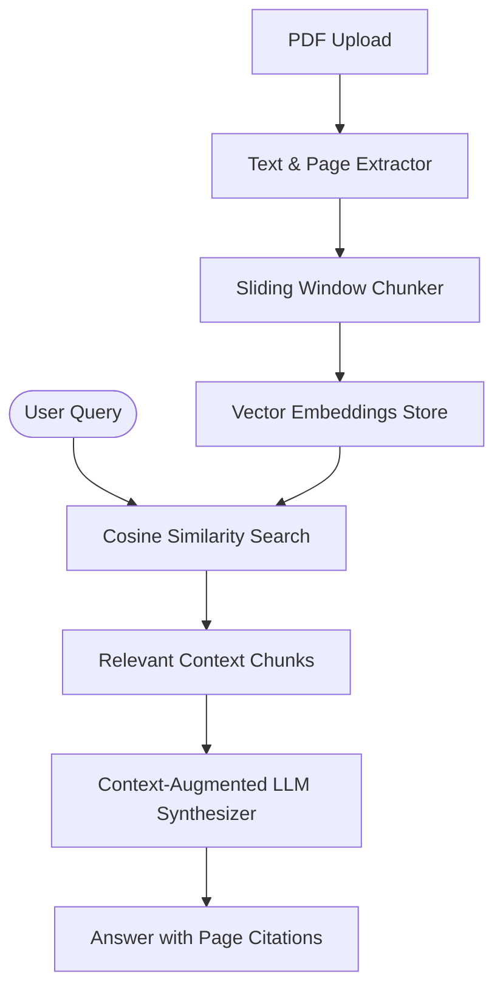

# PDF RAG Chatbot

An end-to-end Retrieval-Augmented Generation (RAG) chatbot for PDF document analysis featuring text extraction, sliding-window chunking, vector similarity retrieval, and exact page-level source citations.

Part of the **50 AI Automation Projects Portfolio** by [ERHA TECHNOLOGIES](https://github.com/erhatechnologiesai).

---

## Architecture


## Testing
```bash
python -m unittest tests/test_pdf_rag.py
```
